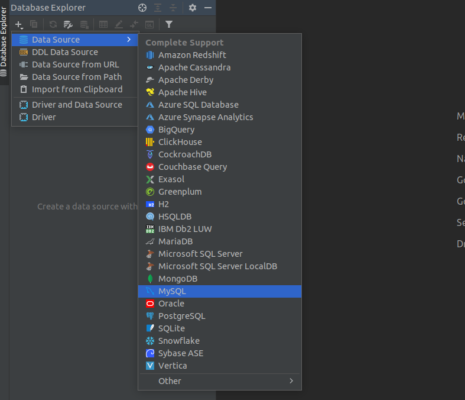
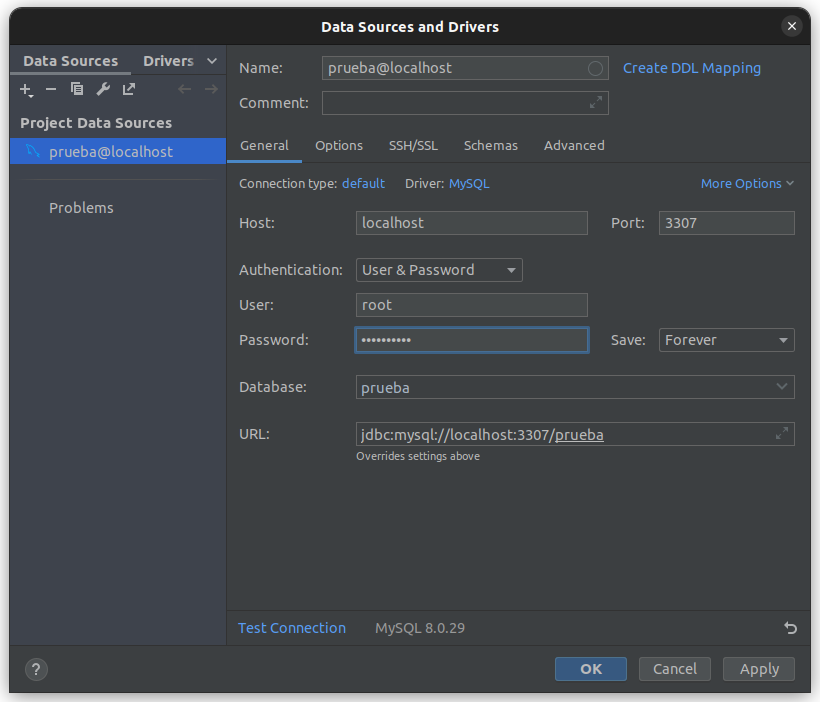

# Portafolio de evidencias para Taller de BBDD

## Primeros pasos
1. Levantar el servicio MySQL server con docker

En la carpeta docker-compose/secrets configura tu contraseña para del servicio en `mysql_root_pass.txt`

abre una terminal en el path docker-compose y ejecuta 

```bash
docker-compose up -d
```

> En caso de necesitar un usuario diferente a tu, deberás configurar el servicio `database`:

```yaml
environment:
	#MYSQL_USER_FILE: /run/secrets/user
    #MYSQL_PASSWORD_FILE: /run/secrets/user_pass
    MYSQL_ROOT_PASSWORD_FILE: /run/secrets/mysql_root_pass
    SERVICE_TAGS: testing
    SERVICE_NAME: database
secrets:
     - mysql_root_pass
     #- user
     #- user_pass
```

> no olvides mencionar los archivos de los secrets:

```yaml
secrets:
  mysql_root_pass:
    file: ./secrets/mysql_root_pass.txt
  user:
    file:
  user_pass:
    file:
```

> si requieres una versión específica configura el `mysql.dockerfile`

```dockerfile
FROM mysql:8.0.29-oracle
```

2. Configurar el entorno de desarrollo integrado

Una vez levantado el servicio puedes configurar el CASE de tu preferncia. En este caso se hace uso de [DataGrip](https://www.jetbrains.com/es-es/datagrip/) con licencia para estudiantes



De acuerdo a tus credenciales deberás llenar los campos



3. Entrar al CLI de MySQL

Para acceder a la consola CLI basta con ejecutar

```bash
docker exec -it nombre_cotenedor mysql -u nombre_usuario -P numero_puerto -p
```